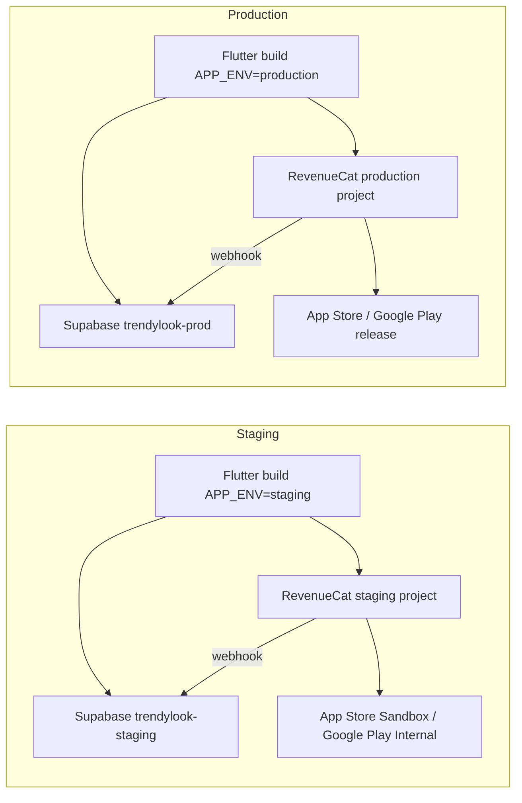
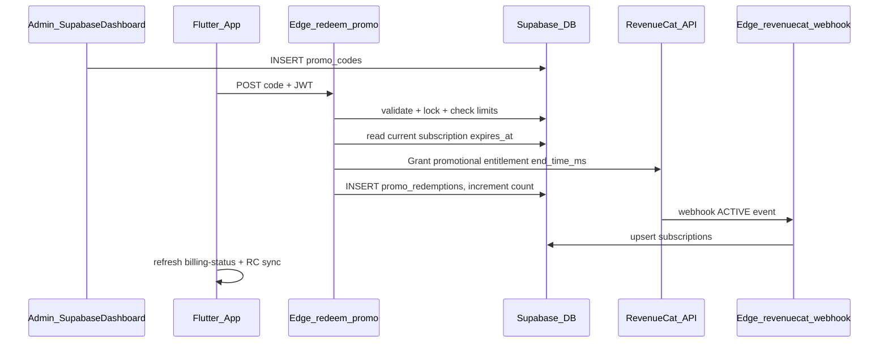

# План и техзадание: система промокодов Trendy Look

**Статус:** Draft (план работ, не реализовано)  
**Связанные документы:** [TECH_SPEC_v1.2.md](TECH_SPEC_v1.2.md), [README.md](README.md)

## 0. Текущее состояние RevenueCat (важно)

**RevenueCat в приложении сейчас не подключён.** Есть только заготовки в коде и Edge Functions, но ни один компонент не работает end-to-end:

| Компонент | Статус |
|-----------|--------|
| Flutter SDK `purchases_flutter` | Зависимость есть, но [`PurchasesRepository.init()`](lib/features/paywall/data/purchases_repository.dart) **выходит сразу**, если `REVENUECAT_API_KEY_IOS/ANDROID` пусты (по умолчанию пусты в [`AppConfig`](lib/core/config/app_config.dart)) |
| Paywall | Показывает fallback-цены; покупка бросает [`PurchasesNotConfiguredException`](lib/features/paywall/presentation/paywall_controller.dart) |
| RevenueCat Dashboard | **Не создан** / не настроен (проект, продукты, entitlement, webhook) |
| App Store Connect / Google Play | Подписки `weekly_unlimited` / `halfyear_unlimited` **не заведены** в сторах |
| Supabase secrets | `REVENUECAT_WEBHOOK_SECRET` **не задан**; `revenuecat-webhook` не получает события |
| Entitlement в приложении | Работает **только через Supabase** (`billing-status` → `subscriptions`), не через RC SDK |
| Промокоды | **Не реализованы** (нет таблиц, нет `redeem-promo`) |
| **Staging / Production** | **Не разделены** — один Supabase-проект (`jilreygcmqhemhsmetqd`), URL/ключи захардкожены как default в [`AppConfig`](lib/core/config/app_config.dart); flavors/launch-профилей нет |

**Вывод:** сначала поднимаем **staging-окружение**, на нём тестируем RC + промокоды; production — только после sign-off. План: **Этап −1 (staging)** → **Этап 0 (RC на staging)** → **Этап 1 (промокоды)** → **Этап 2 (UI)** → **Этап 3 (QA staging)** → **Этап 4 (prod rollout)**.

---

## 0.1 Staging-окружение — архитектура



**Правило:** staging и production **полностью изолированы** — разные Supabase-проекты, разные RC-проекты (или минимум разные webhook URL + API keys), разные секреты Edge Functions. Тестовые промокоды и sandbox-покупки **никогда** не попадают в prod БД.

### Матрица окружений

| Параметр | Staging (тестовая интеграция) | Production |
|----------|-------------------------------|------------|
| Supabase project | **Новый** `trendylook-staging` | Текущий `jilreygcmqhemhsmetqd` или отдельный prod |
| Supabase URL / anon key | Через `--dart-define`, без default в коде для staging | `--dart-define` или CI secrets |
| Edge Functions | Deploy на staging project | Deploy на prod project |
| RC project | **Отдельный** «Trendy Look Staging» | «Trendy Look» production |
| RC webhook URL | `https://<staging-ref>.supabase.co/functions/v1/revenuecat-webhook` | `https://<prod-ref>.supabase.co/functions/v1/...` |
| Store purchases | **Sandbox only** (Apple Sandbox Tester, Google license testers) | Live после approve |
| Promo codes | Тестовые (`STAGING30`, …) в staging `promo_codes` | Боевые коды только в prod |
| Flutter `APP_ENV` | `staging` | `production` |
| Bundle ID / applicationId | `*.staging` suffix (side-by-side с prod на устройстве) | Production IDs |
| OpenAI | Отдельный ключ или тот же с лимитом — **на staging** | Prod key |

---

## 0.2 Этап −1 — Поднять staging (1–2 дня)

### 0.2.1 Supabase staging-проект

1. Supabase Dashboard → **New project** → `trendylook-staging` (тот же регион eu-central-1).
2. Локально: `supabase link --project-ref <staging-ref>`.
3. Применить миграции: `supabase db push` (все файлы из [`supabase/migrations/`](supabase/migrations/)).
4. Deploy Edge Functions на staging:
   ```bash
   supabase functions deploy analyze-look
   supabase functions deploy billing-status
   supabase functions deploy revenuecat-webhook
   supabase functions deploy delete-account
   ```
5. **Secrets** (staging project → Edge Functions → Secrets):

   | Secret | Значение |
   |--------|----------|
   | `OPENAI_API_KEY` | Ключ для тестов (можно отдельный с лимитом) |
   | `REVENUECAT_WEBHOOK_SECRET` | Уникальный для staging (≠ prod) |
   | `REVENUECAT_SECRET_API_KEY` | Staging RC Secret API Key (Этап 1) |
   | `REVENUECAT_ENTITLEMENT_ID` | напр. `pro` |

6. Auth providers на staging: Google + Apple (те же OAuth clients или отдельные staging clients — см. ниже).
7. Storage bucket `look-photos` — создаётся миграцией; проверить policies.

### 0.2.2 RevenueCat staging (подготовка, детали — Этап 0)

1. Создать **отдельный проект** RevenueCat «Trendy Look Staging» (не смешивать webhook с prod).
2. Добавить iOS/Android apps (bundle id staging — см. 0.2.4).
3. Webhook → **только staging Supabase URL** + staging `REVENUECAT_WEBHOOK_SECRET`.

### 0.2.3 Flutter — конфигурация staging

**Изменения в коде** (Этап −1):

1. [`AppConfig`](lib/core/config/app_config.dart) — добавить:
   ```dart
   static const appEnv = String.fromEnvironment('APP_ENV', defaultValue: 'staging');
   static bool get isStaging => appEnv == 'staging';
   static bool get isProduction => appEnv == 'production';
   ```
2. **Убрать prod-default для staging-сборок:** `SUPABASE_URL` / `SUPABASE_ANON_KEY` передавать явно через `--dart-define` (defaults в коде оставить для обратной совместимости dev или пометить deprecated).
3. Добавить [`.vscode/launch.json`](.vscode/launch.json) с профилем **Trendy Look (Staging)**:
   ```json
   {
     "name": "Trendy Look (Staging)",
     "request": "launch",
     "type": "dart",
     "toolArgs": [
       "--dart-define=APP_ENV=staging",
       "--dart-define=SUPABASE_URL=https://<staging-ref>.supabase.co",
       "--dart-define=SUPABASE_ANON_KEY=<staging-anon-key>",
       "--dart-define=REVENUECAT_API_KEY_IOS=appl_staging_...",
       "--dart-define=REVENUECAT_API_KEY_ANDROID=goog_staging_...",
       "--dart-define=GOOGLE_SERVER_CLIENT_ID=..."
     ]
   }
   ```
4. Добавить [`STAGING.md`](STAGING.md) — чеклист запуска, ref проекта, где взять ключи (без секретов в git).

**Опционально для side-by-side установки:**

- **iOS:** bundle id `com.trendylook.app.staging`, display name «Trendy Look STG».
- **Android:** `applicationIdSuffix ".staging"`, `resValue` для label «Trendy Look STG».

Реализация через **Flutter flavors** (`staging` / `production`) — рекомендуется, но для MVP достаточно `--dart-define` + ручной bundle id в Xcode для одного тестера.

### 0.2.4 OAuth на staging

- **Google:** можно использовать тот же Web Client ID, добавив staging bundle id / SHA-1 в Google Cloud Console.
- **Apple:** тот же Services ID или отдельный — зависит от bundle id staging.
- Supabase Auth → Redirect URLs / Site URL — добавить staging deep links при необходимости.

### 0.2.5 Критерии готовности Этапа −1

- [ ] Staging Supabase: миграции применены, advisors чистые
- [ ] Edge Functions задеплоены, `billing-status` отвечает с JWT
- [ ] Flutter запускается с launch profile «Staging», логин работает
- [ ] Staging и prod Supabase **не пересекаются** по данным
- [ ] `STAGING.md` / README обновлены

**Только после этого** — Этап 0 (RC) **на staging**.

---

## 1. Цели

- Админ создаёт промокоды в **Supabase Dashboard** (Table Editor): строка кода, лимит активаций, срок премиума в днях.
- Пользователь вводит код в приложении → получает Pro-доступ.
- **RevenueCat — источник entitlement** для промо (как и для платных подписок): выдача через REST API, синхронизация в [`subscriptions`](supabase/migrations/20260729142541_core_schema.sql) через существующий [`revenuecat-webhook`](supabase/functions/revenuecat-webhook/index.ts).
- При уже активном Pro доступ **продлевается**: `new_expires = max(current_expires, now + duration_days)`.

---

## 2. Архитектура



**Принцип:** серверная проверка Pro в [`analyze-look`](supabase/functions/analyze-look/index.ts) и [`billing-status`](supabase/functions/billing-status/index.ts) **не меняется** — они читают `subscriptions`. Промокод не обходит RevenueCat, а регистрируется в RC и попадает в БД через webhook.

---

## 3. Модель данных (новая миграция)

### 3.1 Таблица `promo_codes`

| Поле | Тип | Описание |
|------|-----|----------|
| `id` | uuid PK | |
| `code` | text UNIQUE NOT NULL | Нормализованный код (UPPER, без пробелов), напр. `CREATOR30` |
| `max_redemptions` | int NOT NULL | Макс. число успешных активаций |
| `redemption_count` | int DEFAULT 0 | Счётчик использований |
| `duration_days` | int NOT NULL | Срок премиума в днях (1–365) |
| `valid_until` | timestamptz NULL | Срок действия самого кода (NULL = бессрочно) |
| `is_active` | boolean DEFAULT true | Ручное отключение |
| `note` | text NULL | Комментарий для админа («кампания X») |
| `created_at` / `updated_at` | timestamptz | |

**Индексы:** UNIQUE на `upper(trim(code))` (или хранить уже нормализованный `code`).

### 3.2 Таблица `promo_redemptions`

| Поле | Тип | Описание |
|------|-----|----------|
| `id` | uuid PK | |
| `promo_code_id` | uuid FK → promo_codes | |
| `user_id` | uuid FK → profiles | |
| `redeemed_at` | timestamptz | |
| `granted_expires_at` | timestamptz | Фактический срок после правила extend |
| `revenuecat_request_id` | text NULL | Для отладки |

**Ограничения:**

- `UNIQUE (promo_code_id, user_id)` — один пользователь не может активировать один код дважды.
- Триггер или атомарная RPC: `redemption_count` увеличивается только при успешном redeem.

### 3.3 Расширение `subscriptions`

```sql
ALTER TYPE plan_type ADD VALUE IF NOT EXISTS 'promo';
ALTER TABLE subscriptions
  ADD COLUMN source text NOT NULL DEFAULT 'revenuecat',
  ADD COLUMN promo_code_id uuid REFERENCES promo_codes(id);
```

- `source`: `'revenuecat'` | `'promo'`
- `plan`: для промо → `'promo'`
- Существующий partial unique index `idx_one_active_subscription_per_user` **остаётся** — одна активная/grace запись на пользователя.

### 3.4 RLS

- `promo_codes`: **нет доступа для authenticated** (только service role / Edge Functions).
- `promo_redemptions`: SELECT только свои записи (`user_id = auth.uid()`); INSERT/UPDATE — только service role.

---

## 4. Этап 0 — Базовая интеграция RevenueCat **на staging** (обязательный prerequisite)

Промокоды и платные подписки используют **один entitlement** в RevenueCat. Вся интеграция и E2E-тесты выполняются **только на staging** (Этап −1). Production RC подключается на **Этапе 4** после sign-off.

### 4.0.1 RevenueCat Dashboard (staging project)

1. Проект **«Trendy Look Staging»** (отдельный от production).
2. Добавить приложения **iOS** и **Android** с **staging bundle id** (см. 0.2.4).
3. Создать **Entitlement** с идентификатором, напр. `pro` (зафиксировать — пойдёт в секрет `REVENUECAT_ENTITLEMENT_ID`).
4. Создать продукты в RC, привязать к entitlement:
   - `weekly_unlimited` — auto-renewable weekly
   - `halfyear_unlimited` — auto-renewable 6 months
5. Создать **Offering** `default` (или `current`) с двумя packages — weekly и halfyear.
6. Скопировать **Public SDK keys** (iOS / Android) для Flutter.
7. Создать **Secret API Key (V1)** для server-side grant промо.
8. Настроить **Webhook** (staging only):
   - URL: `https://<staging-ref>.supabase.co/functions/v1/revenuecat-webhook`
   - Authorization: `Bearer <staging REVENUECAT_WEBHOOK_SECRET>`

### 4.0.2 App Store Connect (iOS) — sandbox для staging

1. Subscription Group «Trendy Look Pro» (или аналог).
2. Продукты с ID **`weekly_unlimited`** и **`halfyear_unlimited`** — можно привязать к staging app с bundle id `*.staging` или использовать тот же app с sandbox tester (проще для MVP: **тот же bundle id**, sandbox-only тесты без отдельного staging bundle).
3. **Sandbox tester** — обязателен для E2E на staging.
4. Связать App Store Connect со **staging** RC project.

> **MVP-упрощение:** если отдельный staging bundle id откладывается, тестируем sandbox на debug-сборке с prod bundle id, но webhook и БД — **только staging Supabase**. Главное — изоляция backend, не обязательно side-by-side apps.

### 4.0.3 Google Play Console (Android) — internal testing для staging

1. Подписки `weekly_unlimited`, `halfyear_unlimited`.
2. Связать Google Play со **staging** RC project (Service Account JSON).
3. **License testers** + internal testing track для sandbox E2E.

### 4.0.4 Supabase secrets (staging project, Этап 0)

| Secret | Когда |
|--------|-------|
| `REVENUECAT_WEBHOOK_SECRET` | Этап 0 — уникальный для staging |
| `REVENUECAT_SECRET_API_KEY` | Этап 1 — staging RC Secret Key |
| `REVENUECAT_ENTITLEMENT_ID` | Этап 1 — напр. `pro` |

Deploy на **staging**: `supabase link --project-ref <staging-ref> && supabase functions deploy revenuecat-webhook`.

### 4.0.5 Flutter — довести SDK до рабочего состояния

**Уже есть:** [`PurchasesRepository`](lib/features/paywall/data/purchases_repository.dart), [`PaywallController`](lib/features/paywall/presentation/paywall_controller.dart), bootstrap в [`app.dart`](lib/app.dart).

**Нужно доработать в коде:**

1. **Staging launch profile** — ключи staging RC через `--dart-define` (см. 0.2.3):
   ```bash
   flutter run --dart-define=APP_ENV=staging \
     --dart-define=SUPABASE_URL=https://<staging-ref>.supabase.co \
     --dart-define=SUPABASE_ANON_KEY=<staging-anon> \
     --dart-define=REVENUECAT_API_KEY_IOS=appl_staging_... \
     --dart-define=REVENUECAT_API_KEY_ANDROID=goog_staging_...
   ```

2. **`Purchases.logIn` / `logOut` при смене пользователя** — сейчас `_purchasesInitialized` блокирует повторный init; при logout/login другого аккаунта RC может остаться на старом `app_user_id`. Нужно:
   - при login: `Purchases.logIn(supabaseUserId)` (или re-configure)
   - при logout: `Purchases.logOut()`

3. **`syncPurchases()`** — добавить метод в `PurchasesRepository` для вызова после redeem/restore (нужен на Этапе 2).

4. **Проверка paywall E2E** на физическом устройстве:
   - offerings загружаются (`hasPackage: true`)
   - покупка sandbox → RC webhook → запись в `subscriptions`
   - `billing-status` → `is_pro: true`
   - restore purchases работает

### 4.0.6 Критерии готовности Этапа 0 (staging sign-off для RC)

- [ ] Sandbox-покупка weekly/halfyear на **staging-сборке** → запись в **staging** `subscriptions`
- [ ] Webhook staging URL получает события (проверить RC Dashboard → Webhooks → deliveries)
- [ ] `billing-status` на staging → `is_pro: true`
- [ ] `analyze-look` на staging пропускает Pro без списания free checks
- [ ] Restore purchases работает
- [ ] Logout/login другого аккаунта → корректный RC `app_user_id`

**Только после staging sign-off RC** — Этап 1 (промокоды на staging).

---

## 5. RevenueCat интеграция для промокодов (Этап 1)

### 5.1 Предусловие

Entitlement, webhook и Secret API Key уже настроены на **Этапе 0**. Здесь только grant promotional и доработка webhook.

### 5.2 Секреты Supabase (дополнительно к Этапу 0)

| Secret | Назначение |
|--------|------------|
| `REVENUECAT_SECRET_API_KEY` | REST API v1 для grant promotional |
| `REVENUECAT_ENTITLEMENT_ID` | Идентификатор entitlement, напр. `pro` |

### 5.3 Grant Promotional Entitlement (при redeem)

```
POST https://api.revenuecat.com/v1/subscribers/{supabase_user_id}/entitlements/{ENTITLEMENT_ID}/promotional
Authorization: Bearer {REVENUECAT_SECRET_API_KEY}
Content-Type: application/json

{ "end_time_ms": <unix_ms> }
```

Где `end_time_ms = max(current_expires_at, now + duration_days)`.

- `app_user_id` = Supabase UUID (уже используется в [`Purchases.configure(appUserID)`](lib/features/paywall/data/purchases_repository.dart)).
- RC объединяет entitlement: при extend новая дата окончания не будет короче уже оплаченной подписки.

### 5.4 Изменения webhook

Текущая проблема: webhook **игнорирует** события без известного `product_id`:

```128:132:supabase/functions/revenuecat-webhook/index.ts
    const plan = event.product_id ? PRODUCT_TO_PLAN[event.product_id] : undefined;
    if (!plan) {
      console.error(`Unknown product_id in RevenueCat event: ${event.product_id}`);
      return jsonResponse({ received: true, ignored: "unknown_product_id" });
```

**Нужно:**

- Если `product_id` отсутствует или неизвестен, но есть `expiration_at_ms` — трактовать как **promotional grant**: `plan = 'promo'`, `source = 'promo'`.
- При upsert: `expires_at = max(existing.expires_at, new.expires_at)` если оба active (защита от регресса срока).
- `EXPIRATION`: доверять RC; если entitlement истёк — `status = 'expired'` (как сейчас).

---

## 6. Edge Function: `redeem-promo`

**Путь:** [`supabase/functions/redeem-promo/index.ts`](supabase/functions/redeem-promo/index.ts) (новый)

### 6.1 Контракт

**Request:** `POST`, JWT обязателен

```json
{ "code": "CREATOR30" }
```

**Response 200:**

```json
{
  "success": true,
  "expires_at": "2026-09-25T12:00:00Z",
  "extended": true
}
```

**Ошибки:**

| HTTP | code | Условие |
|------|------|---------|
| 400 | `invalid_code` | Пустой/невалидный формат |
| 404 | `code_not_found` | Код не существует |
| 410 | `code_expired` | `valid_until < now` или `is_active = false` |
| 409 | `code_exhausted` | `redemption_count >= max_redemptions` |
| 409 | `already_redeemed` | Повторная активация того же кода |
| 502 | `revenuecat_error` | RC API недоступен / ошибка |
| 401 | `unauthorized` | Нет JWT |

### 6.2 Алгоритм (атомарный)

1. Auth → `user_id`.
2. Нормализация: `code.trim().toUpperCase()`.
3. **Postgres RPC** `redeem_promo_code(p_code, p_user_id)` в одной транзакции:
   - `SELECT ... FROM promo_codes WHERE code = p_code FOR UPDATE`
   - проверки: active, valid_until, count < max, нет записи в promo_redemptions
   - **не** инкрементировать count до успеха RC (или rollback при ошибке RC)
4. Прочитать текущий `subscriptions.expires_at` (active/grace).
5. Вычислить `granted_expires_at = max(current, now + duration_days)`.
6. Вызвать RC Grant Promotional API.
7. При успехе: INSERT `promo_redemptions`, `redemption_count += 1`.
8. Опционально **optimistic upsert** в `subscriptions` (чтобы UI не ждал webhook); webhook затем подтвердит.
9. Вернуть ответ.

**Rate limit:** не более 5 попыток redeem / user / hour (простая проверка по `promo_redemptions.redeemed_at` или in-memory + лог).

---

## 7. Flutter — промокоды (Этап 2)

### 7.1 Новые файлы

- [`lib/features/paywall/data/promo_repository.dart`](lib/features/paywall/data/promo_repository.dart) — вызов `redeem-promo`.
- Расширение [`paywall_controller.dart`](lib/features/paywall/presentation/paywall_controller.dart) или отдельный `PromoController`.

### 7.2 UI

- **Paywall** ([`paywall_screen.dart`](lib/features/paywall/presentation/paywall_screen.dart)): поле ввода + кнопка «Активировать промокод» под планами.
- **Profile** ([`profile_screen.dart`](lib/features/profile/presentation/profile_screen.dart)): та же секция для пользователей без лимита.

### 7.3 После успешного redeem

1. `billingProvider.refresh()` → [`billing-status`](supabase/functions/billing-status/index.ts).
2. `Purchases.syncPurchases()` (если RC configured) — SDK подтянет entitlement.
3. Snackbar с датой окончания; analytics event `promo_redeemed`.

### 7.4 Локализация

Строки во все [`lib/l10n/app_*.arb`](lib/l10n/app_en.arb): placeholder, кнопка, ошибки (`code_not_found`, `already_redeemed`, …).

### 7.5 billing-status (минимальное расширение)

Добавить в ответ опционально `source` и `plan = promo` — для отображения «Pro (промокод)» в профиле. **Не блокирует MVP.**

---

## 8. Админ-инструкция (Supabase Dashboard)

1. Открыть **Table Editor → promo_codes → Insert row**.
2. Заполнить:
   - `code`: `INFLUENCER30` (заглавные, без пробелов)
   - `max_redemptions`: `50`
   - `duration_days`: `30`
   - `valid_until`: опционально `2026-12-31`
   - `is_active`: `true`
   - `note`: «Блогер @name, март 2026»
3. `redemption_count` не трогать (0 по умолчанию).
4. Для отключения: `is_active = false`.
5. Мониторинг: таблица `promo_redemptions` — кто и когда активировал.

**Пример SQL для массового создания:**

```sql
INSERT INTO promo_codes (code, max_redemptions, duration_days, valid_until, note)
VALUES ('LAUNCH100', 100, 14, '2026-06-01', 'Launch campaign');
```

---

## 9. Безопасность

- Коды не читаются клиентом напрямую — только через `redeem-promo`.
- Brute-force: rate limit + generic ошибка «код не найден» для exhausted/expired (опционально, чтобы не палить статус кода).
- RC Secret API Key только в Supabase secrets, не в Flutter.
- Idempotency: повторный запрос с тем же `(user_id, promo_code_id)` → `already_redeemed`, без повторного вызова RC.

---

## 10. Тест-план

### 10.1 Staging infrastructure (Этап −1)

| # | Сценарий | Ожидание |
|---|----------|----------|
| S1 | Flutter `APP_ENV=staging` + staging Supabase URL | Auth, checks, billing-status работают на staging БД |
| S2 | Prod default URL без staging defines | Не смешивается со staging (явный выбор окружения) |
| S3 | Edge Functions на staging | `analyze-look`, `billing-status` отвечают |
| S4 | Данные staging ≠ prod | Пользователи/подписки изолированы |

### 10.2 RevenueCat на staging (Этап 0)

| # | Сценарий | Ожидание |
|---|----------|----------|
| R1 | Paywall без dart-define ключей | Snackbar «Оплата не настроена» |
| R2 | Staging paywall + sandbox purchase weekly | **Staging** `subscriptions` active, `is_pro=true` |
| R3 | Restore purchases | Entitlement восстанавливается |
| R4 | Logout → login другой аккаунт | RC `app_user_id` = новый Supabase UUID |
| R5 | Webhook EXPIRATION после окончания sandbox sub | `status=expired`, free checks снова лимитированы |
| R6 | RC webhook delivery log | Events идут на **staging** URL, не prod |

### 10.3 Промокоды на staging (Этапы 1–2)

| # | Сценарий | Ожидание |
|---|----------|----------|
| 1 | Активация валидного кода free-user | Pro, `free_checks` не тратятся, expires = now+days |
| 2 | Повторная активация того же кода | 409 `already_redeemed` |
| 3 | Код исчерпан (count = max) | 409 `code_exhausted` |
| 4 | Pro с платной подпиской до декабря + промо 30 дней | expires = max(декабрь, now+30) |
| 5 | Webhook после grant | `subscriptions`: plan=promo, source=promo, status=active |
| 6 | Истечение entitlement в RC | webhook EXPIRATION → status=expired, analyze-look блокирует |
| 7 | `is_active=false` | 410 `code_expired` |
| 8 | RC API down | 502, count не увеличен, redemption не создан |

### 10.4 Production rollout (Этап 4)

| # | Сценарий | Ожидание |
|---|----------|----------|
| P1 | Prod Supabase: миграции + functions deploy | Идентичная схема со staging |
| P2 | Prod RC project + live webhook URL | Webhook → prod Supabase only |
| P3 | Prod secrets ≠ staging secrets | Отдельные webhook secret, API keys |
| P4 | Smoke: prod sandbox (TestFlight / internal) | Одна покупка + один промокод |
| P5 | Staging promo codes не работают на prod | `code_not_found` |

---

## 11. Этапы реализации (итоговый порядок)

### Этап −1 — Staging infrastructure (1–2 дня)

- Новый Supabase project `trendylook-staging`
- Deploy migrations + Edge Functions + secrets
- Flutter: `APP_ENV`, launch profile, [`STAGING.md`](STAGING.md)
- Auth providers на staging

### Этап 0 — RevenueCat end-to-end **на staging** (2–4 дня)

- RC staging project + sandbox store products
- Webhook → staging Supabase URL
- Flutter staging keys, `logIn`/`logOut`, `syncPurchases`
- E2E sandbox → staging `subscriptions` → sign-off чеклист 4.0.6

### Этап 1 — Промокоды backend **на staging** (1–2 дня)

- Миграция на staging: таблицы + enum `promo` + RLS + RPC
- `redeem-promo` + staging RC Secret API Key
- `revenuecat-webhook` promotional events (deploy staging)

### Этап 2 — Промокоды Flutter (0.5–1 день)

- `PromoRepository`, UI paywall/profile, l10n
- Тесты только против staging backend

### Этап 3 — QA staging sign-off (0.5–1 день)

- S1–S4 + R1–R6 + промо 1–8
- Фиксация багов до prod

### Этап 4 — Production rollout (1–2 дня, после sign-off)

- Prod Supabase: `db push` + functions deploy
- Отдельный RC production project + live products
- Prod secrets (webhook, API keys) — **не копировать со staging**
- Prod launch profile / CI `--dart-define=APP_ENV=production`
- Smoke P1–P5
- Обновить [`README.md`](README.md): staging vs production таблица

**Оценка суммарно:** 6–10 рабочих дней (Этап −1/0 зависят от настройки staging Supabase и sandbox сторов).

---

## 12. Что сознательно не входит в MVP

- Отдельный admin UI / Edge Function `create-promo`
- Deep link `trendylook://promo/CODE`
- Per-user одноразовые коды (только per-code лимит)
- Автогенерация кодов

---

## 13. Зависимости и риски

| Риск | Митигация |
|------|-----------|
| **Нет staging — тесты бьют в prod** | Этап −1 обязателен; webhook URL и secrets раздельные |
| **RC webhook на wrong env** | Staging/prod RC projects раздельно; проверять delivery log (R6) |
| **RC не подключён** | Этап 0 на staging; promos блокируются до E2E |
| Staging/prod secrets перепутаны | Таблица секретов в STAGING.md; разные webhook bearer tokens |
| Ревью подписок в сторах | Sandbox на staging не требует live release |
| Webhook приходит позже UI | Optimistic upsert в redeem + refresh |
| Race на последнюю активацию | `FOR UPDATE` + RPC транзакция |
| RC grant OK, DB insert fail | Лог + manual fix на staging до prod |
| Смена аккаунта без logOut RC | Исправить в Этапе 0 |
